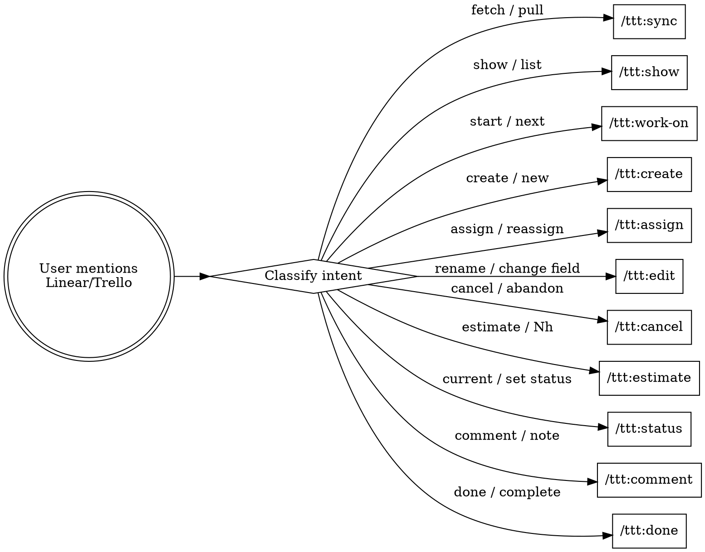

<law>
ALL task operations MUST go through the `ttt` CLI via Bash tool.
NEVER manually edit `.ttt/` files (cycle.toon, config.toon, local.toon).
NEVER fabricate issue data — always run the CLI to get real data.
After completing any task, MUST execute `/ttt:done -m "summary"`.
</law>

# Task Manager (Linear/Trello)

Manage developer task workflows using the `ttt` CLI.

## Command Router

Match user intent to the correct `/ttt:*` command:

| User Intent | Command | Example |
|-------------|---------|---------|
| Sync/fetch issues | `/ttt:sync` | "sync my issues", "pull from Linear" |
| Show/search issues | `/ttt:show` | "show MP-624", "list my tasks", "what issues do I have" |
| Start working on a task | `/ttt:work-on` | "work on next", "start MP-624" |
| Create a new issue | `/ttt:create` | "create issue", "open a ticket", "new task" |
| Reassign an issue | `/ttt:assign` | "assign MP-624 to john", "reassign to jane" |
| Edit issue fields | `/ttt:edit` | "rename MP-624", "change priority", "update labels" |
| Cancel an issue | `/ttt:cancel` | "cancel MP-624", "abandon this task" |
| Record an estimate | `/ttt:estimate` | "estimate MP-624 as 6h", "save 2.5h estimate" |
| Check/change status | `/ttt:status` | "what's my current task", "set MP-624 to blocked" |
| Add a comment | `/ttt:comment` | "comment on MP-624", "add note to task" |
| Complete a task | `/ttt:done` | "done", "mark complete", "finish task" |

**When a matching intent is detected, invoke the corresponding `/ttt:*` slash command.**

## Quick Reference

```bash
ttt sync                    # Sync Todo/In Progress issues
ttt sync --all              # Sync all statuses
ttt sync MP-624             # Sync specific issue
ttt show                    # List all local issues
ttt show MP-624             # Show issue details
ttt show --user me          # My issues
ttt work-on next            # Auto-select highest priority
ttt work-on MP-624          # Start specific task
ttt create                  # Create new issue (interactive)
ttt create -t "Title" -p 2  # Quick create with flags
ttt assign MP-624 -a john   # Reassign issue
ttt edit MP-624 -t "New"    # Edit title (or -d/-p/-l)
ttt cancel MP-624           # Cancel an issue
ttt estimate MP-624 6       # Save a 6-hour human estimate
ttt status                  # Current in-progress task
ttt status MP-624 --set +1  # Advance status
ttt comment MP-624 -m "msg" # Add comment to issue
ttt comment -m "msg"        # Comment on current task
ttt done -m "summary"       # Complete with message
```

## Prerequisites

- **Linear**: `LINEAR_API_KEY` env var set
- **Trello**: `TRELLO_API_KEY` + `TRELLO_TOKEN` env vars set
- `.ttt/` directory initialized (`ttt init`)

## Standard Workflow

```
ttt sync → ttt work-on next → ttt estimate <id> <hours> → [implement] → git commit → ttt comment -m "notes" → ttt done -m "..."
```

## File Structure

```
.ttt/
├── config.toon     # Team configuration
├── local.toon      # Personal settings
├── cycle.toon      # Current cycle tasks + local estimates (auto-generated)
└── output/         # Downloaded attachments
```

## Troubleshooting

| Problem | Solution |
|---------|----------|
| No cycle data | `ttt sync` |
| Issue not found locally | `ttt show <id> --remote` or `ttt sync <id>` (`ttt status` auto-fetches from remote) |
| API key not set | Set `LINEAR_API_KEY` or `TRELLO_API_KEY` + `TRELLO_TOKEN` |
| Stale data | `ttt sync` to refresh |

## Common Rationalizations

| Excuse | Reality |
|--------|---------|
| "I'll edit `cycle.toon` directly, faster" | `cycle.toon` is auto-generated. Manual edits get overwritten on next `ttt sync`. Always go through the CLI. |
| "I remember this issue ID, no need to sync" | Remote status, assignee, priority may have changed. Run `ttt sync` or `ttt show <id> --remote` first. |
| "I'll create the issue in the Linear/Trello UI instead" | Bypassing `ttt create` leaves the new issue outside local cycle data. Use the CLI so it gets tracked. |
| "Task is obvious, skip `/ttt:done`" | `/ttt:done` syncs local + remote status, posts a completion comment, reads git commit info. Skipping leaves state inconsistent. |
| "I know what the task needs without reading it" | Fabricated assumptions produce wrong work. Run `ttt show <id>` before starting. |
| "Fetch issue details via Linear MCP / web UI" | The CLI is authoritative and token-efficient. Use `ttt show` / `ttt sync`, not alternate data paths. |

## Flowchart — Intent Routing


